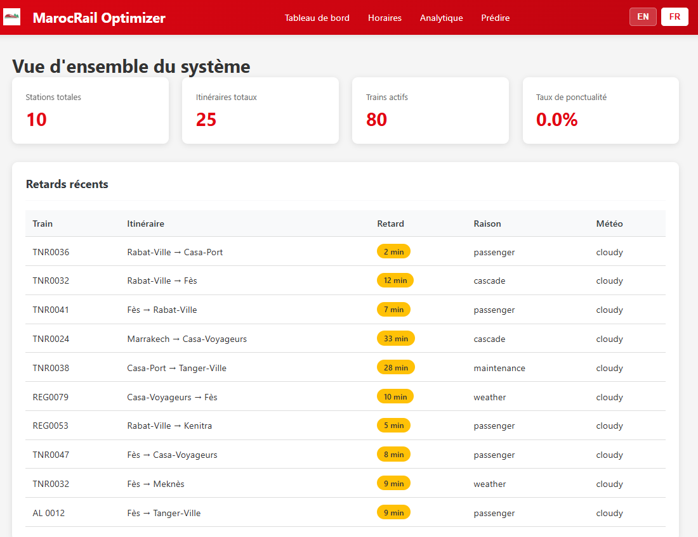
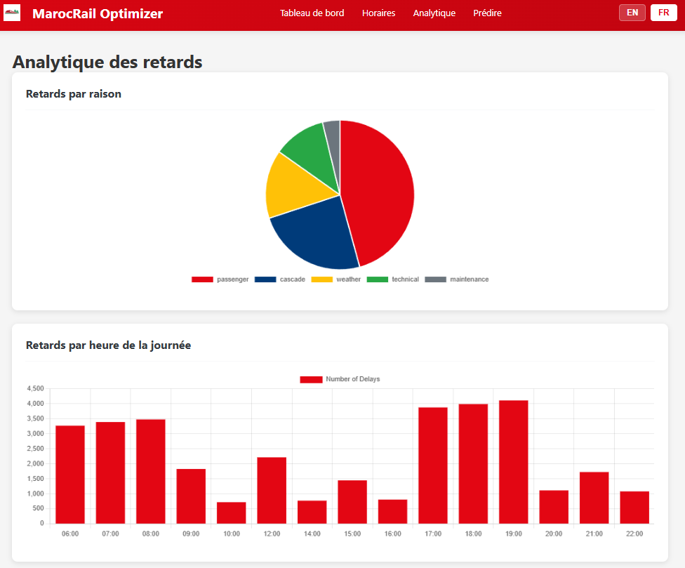

# MarocRail Optimizer 🚂

[](https://python.org/) [](https://flask.palletsprojects.com/) [](https://scikit-learn.org/) [](https://www.sqlite.org/) [](https://html.spec.whatwg.org/) [](https://www.w3.org/Style/CSS/) [](https://developer.mozilla.org/en-US/docs/Web/JavaScript) [](https://www.chartjs.org/) [](https://opensource.org/licenses/MIT)

A sophisticated machine learning-driven train schedule optimization solution developed during my internship at ONCF (Moroccan Railways). This smart solution addresses real operational issues by predicting train delays, scheduling optimization, and providing real-time analytics through an interactive bilingual web dashboard to railway operators.


---
Demo: [marocrail-optimizer-production.up.railway.app](https://marocrail-optimizer-production.up.railway.app/)
---
## 📋 Table of Contents

- [Features](#-features)
- [Demo](#-demo)
- [Technology Stack](#-technology-stack)
- [Installation](#-installation)
- [Usage](#-usage)
- [Project Structure](#-project-structure)
- [ML Model Performance](#-ml-model-performance)
- [API Documentation](#-api-documentation)
- [Data](#-data)
- [Architecture](#-architecture)
- [Future Enhancements](#-future-enhancements)
- [License](#-license)

---

##  Features

This application provides a comprehensive railway management experience with intelligent automation and modern analytics:

### 🤖 Machine Learning Prediction
- **Delay Prediction AI**: Random Forest classifier with **79% accuracy**
- **Smart Analysis**: Predicts delay probability and estimated duration
- **Context-Aware**: Considers weather conditions, time patterns, route history, and cascade effects
- **Real-Time Predictions**: Instant delay risk assessment for any train configuration
- **31 Engineered Features**: Advanced feature engineering for optimal accuracy

###  Schedule Optimization
- **Conflict Detection**: Heuristic-based platform and turnaround time conflict identification
- **Automated Adjustments**: Intelligent schedule modifications and platform reassignments
- **Risk Mitigation**: Identifies and resolves high-risk train scenarios
- **Performance Tracking**: Real-time monitoring of optimization effectiveness
- **Scalable Algorithm**: Handles multiple trains and routes simultaneously

###  Interactive Bilingual Dashboard
- **System Overview**: Real-time statistics, on-time rate, and key performance metrics
- **Schedule Viewer**: Filterable train schedules by day, route, and status
- **Visual Analytics**: Beautiful delay analysis with Chart.js (pie, bar, doughnut charts)
- **ML Prediction Tool**: User-friendly interface for delay prediction
- **Language Switcher**: Complete English/French bilingual support
- **Responsive Design**: Works seamlessly on desktop and mobile devices

###  Complete Data Pipeline
- **Synthetic Data Generation**: Realistic simulation of 10 stations, 25 routes, 80 trains
- **Historical Records**: 6 months of delay data (~34,160 records)
- **Passenger Analytics**: Flow simulation (~54,284 records)
- **Optimized Database**: SQLite with efficient schema and indexing (8.75 MB)
- **Data Integrity**: Comprehensive validation and relationship management

###  Technical Excellence
- **RESTful API**: Complete API endpoints for all data access
- **Session Management**: Persistent user preferences and language selection
- **Modern Frontend**: Clean HTML5/CSS3 with vanilla JavaScript
- **Production Ready**: Structured codebase with separation of concerns
- **Extensible Architecture**: Easy to add new features and integrations

*(For detailed implementation status and roadmap, see project documentation)*

---

##  Demo

**Run the application:**
```bash
python app.py
```

**Open in browser:** `http://localhost:5000`

**Pages:**
- `/` - Home page
- `/dashboard` - System overview
- `/schedules` - Train schedules viewer
- `/analytics` - Delay analytics & charts
- `/predict` - Delay prediction tool

---

##  Technology Stack

| Layer | Technology |
|-------|------------|
| **Backend** | Python 3.9+, Flask 3.0 |
| **Database** | SQLite (8.75 MB) |
| **ML** | Scikit-learn (Random Forest) |
| **Frontend** | HTML5, CSS3, Vanilla JavaScript |
| **Visualization** | Chart.js |
| **Data Processing** | Pandas, NumPy |

---

##  Installation

### Prerequisites
- Python 3.9 or higher
- pip package manager

### Steps

1. **Clone the repository**
```bash
git clone https://github.com/Mizuch1/MarocRail-Optimizer.git
cd MarocRail-Optimizer
```

2. **Install dependencies**
```bash
pip install -r requirements.txt
```

3. **Generate data (if needed)**
```bash
python scripts/generate_all_data.py
python scripts/create_database.py
python scripts/train_model.py
```

4. **Run the application**
```bash
python app.py
```

5. **Access dashboard**
Open browser: `http://localhost:5000`

---

##  Usage

### Running the Application
```bash
python app.py
```
Server starts on `http://localhost:5000`

### Regenerating Data
```bash
python scripts/generate_all_data.py
```

### Retraining ML Model
```bash
python scripts/train_model.py
```

### Running Optimization
```bash
python scripts/optimizer.py
```

### Testing API
```bash
python scripts/test_api.py
```

---

## 📁 Project Structure

```
MarocRail-Optimizer/
├── app.py
├── requirements.txt
├── plan.md
│
├── data/
│   ├── stations.json
│   ├── routes.json
│   ├── trains.json
│   ├── schedules.json
│   ├── delays.json
│   └── passengers.json
│
├── database/
│   ├── marocrail.db
│   └── schema.sql
│
├── models/
│   ├── delay_classifier.pkl
│   ├── delay_regressor.pkl
│   └── feature_columns.pkl
│
├── scripts/
│   ├── generate_*.py
│   ├── create_database.py
│   ├── train_model.py
│   ├── optimizer.py
│   └── test_*.py
│
├── templates/
│   ├── index.html
│   ├── dashboard.html
│   ├── schedules.html
│   ├── analytics.html
│   └── predict.html
│
├── static/
│   ├── style.css
│   ├── logo.png
│   └── translations.js
│
└── images-readme/
    ├── Welcome Page & Language Support.PNG
    ├── Dashboard.PNG
    ├── Analytics.PNG
    ├── Schedule Management.PNG
    └── ML Prediction Interface.PNG
```

---

## 📈 ML Model Performance

### Delay Classifier
- **Algorithm**: Random Forest (100 estimators)
- **Accuracy**: 78.97%
- **Features**: 31 engineered features
- **Training Data**: 34,160 delay records

### Top Features (by importance)
1. Day of week (17.0%)
2. Hour of day (16.5%)
3. Route delay variance (9.6%)
4. Month (9.5%)
5. Historical route delays (9.5%)

### Delay Regressor
- **Algorithm**: Random Forest
- **MAE**: 10.86 minutes
- **Purpose**: Predicts delay duration for delayed trains

---

##  Data

### Synthetic Data Generation

**Railway Network:**
- 10 stations (Casa-Port, Rabat, Fès, Marrakech, Tanger, etc.)
- 25 bidirectional routes
- 80 trains (12 Al Boraq, 35 TNR, 33 Regular)

**Historical Data (6 months):**
- 2,112 weekly schedules (~301 per day)
- 34,160 delay records
- 54,284 passenger flow records

**Delay Patterns:**
- Passenger delays: 45.1%
- Cascade delays: 23.5%
- Weather delays: 16.1%
- Technical issues: 11.4%
- Maintenance: 3.9%

**Data is 100% synthetic** - no real ONCF data used.

---

##  Architecture

```
┌─────────────┐
│   Browser   │
│  Dashboard  │
└──────┬──────┘
       │ HTTP
       ▼
┌─────────────┐      ┌──────────────┐
│    Flask    │─────▶│   SQLite DB  │
│   Backend   │      │   (8.75 MB)  │
└──────┬──────┘      └──────────────┘
       │
       ├─────▶ ML Models (Prediction)
       │       - Classifier
       │       - Regressor
       │
       └─────▶ Optimizer (Conflicts)
               - Platform conflicts
               - Turnaround time
```

---

##  Screenshots

<div align="center">

###  Welcome Page & Language Support
<table>
  <tr>
    <td align="center">
      
      <br>
      <em>MarocRail Optimizer - Welcome Page with Bilingual Support & Creative Signature</em>
    </td>
  </tr>
</table>

###  Dashboard & Real-Time Analytics
<table>
  <tr>
    <td align="center">
      
      <br>
      <em>System Overview - Real-time Statistics, Recent Delays & Today's Schedules</em>
    </td>
  </tr>
  <tr>
    <td align="center">
      
      <br>
      <em>Visual Analytics - Delays by Reason, Hour of Day & Weather Condition</em>
    </td>
  </tr>
</table>

###  Schedule & Prediction Management
<table>
  <tr>
    <td align="center">
      
      <br>
      <em>Train Schedules Viewer - Filterable by Day with Train Details</em>
    </td>
  </tr>
  <tr>
    <td align="center">
      
      <br>
      <em>ML Prediction Tool - Delay Prediction with Configurable Parameters</em>
    </td>
  </tr>
</table>

</div>

---

##  Contributing

Contributions, issues, and feature requests are welcome! Feel free to check the [issues page](https://github.com/Mizuch1/MarocRail-Optimizer/issues).

### How to Contribute:
1. Fork the repository
2. Create your feature branch (`git checkout -b feature/AmazingFeature`)
3. Commit your changes (`git commit -m 'Add some AmazingFeature'`)
4. Push to the branch (`git push origin feature/AmazingFeature`)
5. Open a Pull Request

---

## 📄 License

This project is licensed under the MIT License - see the [LICENSE](LICENSE) file for details.

**Educational Purpose**: This project is for educational and portfolio demonstration purposes.

**Not Affiliated with ONCF**: All data is synthetic and for demonstration purposes only.

---

## 📞 Let's Connect!

<div align="center">

[](mailto:mohamed.jbilou.it@gmail.com)
[](https://www.linkedin.com/in/mohamedjbilou/)
[](https://mohamedjbilou.vercel.app/)
[](https://github.com/Mizuch1)

</div>

---

## 🙏 Acknowledgments

- Built with ❤️ using Flask, Scikit-learn, and modern web technologies
- ONCF (Office National des Chemins de Fer du Maroc)
- Special thanks to the open-source community for amazing tools and libraries
- All data is synthetic and generated for educational purposes

---

```python
# project_info.py

class ProjectInfo:
    def __init__(self, project_name, author, year):
        self.project_name = project_name
        self.author = author
        self.year = year
        self.tech_stack = ['Python', 'Flask', 'Machine Learning', 'SQLite']

    def display_info(self):
        return f"© {self.year} {self.author}. All rights reserved."

    def signature(self):
        return f"Built with passion by {self.author}"
    
    def mission(self):
        return "Optimizing rail transport through intelligent technology"

# Usage
if __name__ == "__main__":
    marocrail = ProjectInfo(
        project_name="MarocRail Optimizer",
        author="Mohamed Jbilou (Mizuchi)",
        year=2025
    )
    print(marocrail.display_info())
    print(marocrail.signature())
    print(marocrail.mission())
    print("\n🚂 May your trains be on time and your code bug-free! 🚂")
```

---

<div align="center">

### 👤 Author

**Mohamed Jbilou "Mizuchi"**

_Full-Stack Developer | ML Engineer | Rail Transport Enthusiast_

---

_Made with ☕ and 💻 by Mizuchi_

**⭐ If you find this project interesting, please consider starring it! ⭐**

</div>
